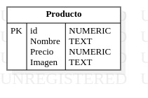

# Bazar

## Objetivo

La creación de una API que, dependiendo del tipo de solicitud que reciba, permita hacer el alta, baja, modificación o lectura de los productos en una base de datos.
Por otra parte, el bazar también necesita conocer su producto más caro y su producto más barato. Para ello necesita desarrollar endpoints que le permitan:

- Obtener el producto más barato.
- Obtener el producto más caro.
- Obtener todos los productos ordenados de más barato a más caro.
- Obtener todos los productos de más caro a más barato.

## Tecnologias usadas

- Spring

## dependencias

- springdoc-openapi-starter-webmvc-ui:2.1.0
- bootstrap:5.3.0
- spring-boot-starter-thymeleaf:3.1.0
- spring-boot-starter-data-jpa
- spring-boot-starter-web
- spring-boot-devtools (scope: runtime, optional: true)
- mysql-connector-j (scope: runtime)
- lombok (optional: true)
- spring-boot-starter-test (scope: test)

## DER
<!-- cargar imagen  -->


## Ejecutar el proyecto

Para ejecutar localmente deberá clonar el repositorio.
Luego crear una base de datos y editar los datos de application.properties  

```.
server.port=8085
spring.jpa.hibernate.ddl-auto=update

spring.datasource.url=jdbc:mysql://localhost:3306/<nombre de la base de datos>
spring.datasource.username=<user>
spring.datasource.password=<password>

spring.thymeleaf.prefix=classpath:/templates/
spring.thymeleaf.suffix=.html
```

para acceder a la documentacion de las apis con swagger ingrese a [http://localhost:8085/swagger-ui/index.html](http://localhost:8085/swagger-ui/index.html)
